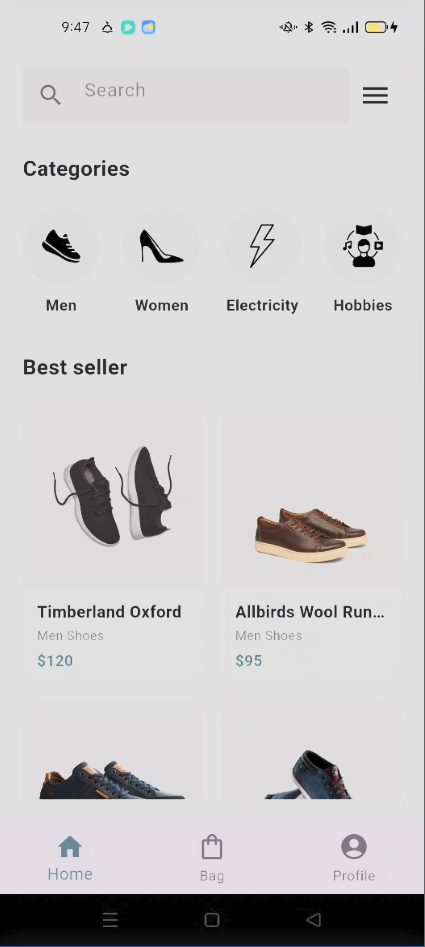
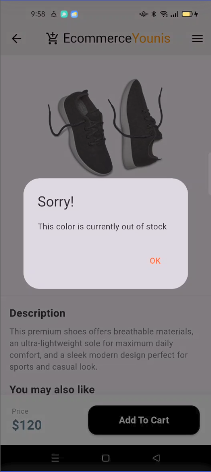

# 👟 Shoe Store App UI

### 🎉 My First Flutter Project!
Welcome to my very first step into mobile app development. This is a beautifully designed, modern E-commerce Shoe Store Mobile Application UI built using Flutter and Dart. This project focuses on high-quality component design, seamless layout alignment, and interactive state management for product selection.
---

## ✨ Features
* **Modern Home View:** Categorized product browsing with customized product display cards.
* **Interactive Product Details:** Dynamic product detail page with custom size selectors (`StatefulWidget`).
* **Clean UI/UX:** Styled shadow elevations, modern typography, and out-of-stock custom dialog popups.
* **Multi-Platform Support:** Structured and ready for Android, iOS, and desktop applications.

---

## 📸 Screenshots

| Home Page | Product Details | Out of Stock Alert |
|---|---|---|
|  |  |  |

---

## 🛠️ Technologies & Concepts Used
* **Framework:** Flutter 🚀
* **Language:** Dart 🎯
* **State Management:** `setState` for real-time item property updates.
* **UI Components:** `GridView.builder`, `ListView.builder`, Custom Dialogs, `InkWell` layout interactions.